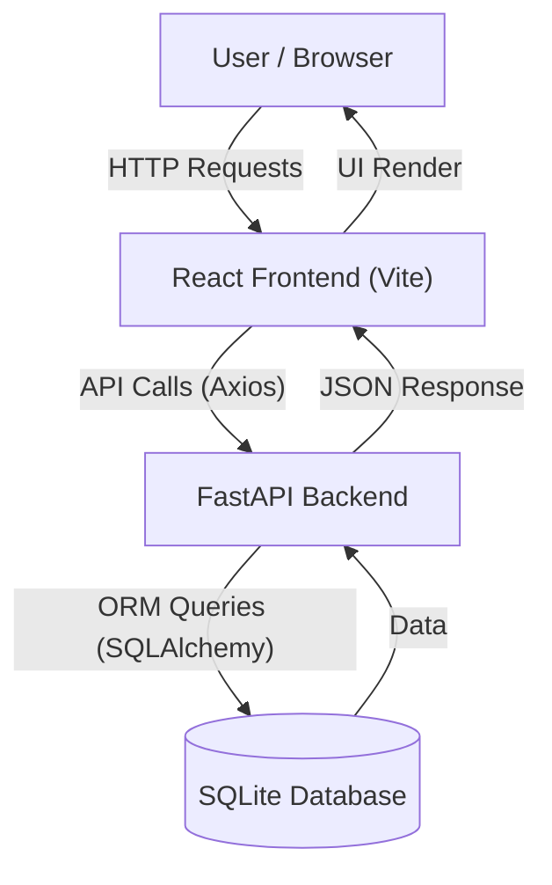

# Personal Finance App

A comprehensive personal finance application designed to help users track transactions, view financial reports, and manage their budget effectively. This project is built with a modern Full Stack approach using **React** for the frontend and **FastAPI** for the backend.

## Features

- **Transaction Management**: 
    - Log income and expenses (Credit/Debit).
    - View a detailed history of all transactions.
- **Financial Reports**:
    - Get weekly summaries of your financial health.
    - View total credits, debits, and net balance.
- **Modern UI**:
    - Clean and responsive user interface built with React and Vite.
- **Fast Backend**:
    - High-performance API powered by FastAPI.
    - Reliable data persistence using SQLite and SQLAlchemy.

## Architecture

The application follows a standard client-server architecture:



## Tech Stack

### Frontend
- **Framework**: [React](https://reactjs.org/) (via [Vite](https://vitejs.dev/))
- **HTTP Client**: [Axios](https://axios-http.com/)
- **Styling**: CSS / CSS Modules

### Backend
- **Framework**: [FastAPI](https://fastapi.tiangolo.com/)
- **Database**: [SQLite](https://www.sqlite.org/index.html)
- **ORM**: [SQLAlchemy](https://www.sqlalchemy.org/)
- **Language**: Python 3.x

## Prerequisites

Before you begin, ensure you have the following installed:
- **Node.js** (v14 or higher) & npm
- **Python** (v3.8 or higher) & pip

## Installation & Setup

### 1. Backend Setup

Navigate to the backend directory and set up the Python environment.

```bash
cd backend
# Create a virtual environment
python -m venv venv

# Activate the virtual environment
# Windows:
venv\Scripts\activate
# macOS/Linux:
# source venv/bin/activate

# Install dependencies
pip install -r requirements.txt
```

Start the backend server:

```bash
uvicorn main:app --reload
```
The backend server will start at `http://127.0.0.1:8000`.

### 2. Frontend Setup

Open a new terminal, navigate to the frontend directory, and install dependencies.

```bash
cd frontend
npm install
```

Start the frontend development server:

```bash
npm run dev
```
The frontend application will be available at `http://localhost:5173`.

## API Documentation

Once the backend is running, you can access the interactive API docs (Swagger UI) at:
- `http://127.0.0.1:8000/docs`

### Key Endpoints:
- `GET /`: Health check.
- `GET /transactions`: List all transactions.
- `POST /transactions`: Create a new transaction.
- `GET /reports/weekly`: Get weekly financial summary.

## Project Structure

```
finance_app/
├── backend/            # FastAPI backend
│   ├── main.py         # App entry point
│   ├── models.py       # DB models & Pydantic schemas
│   ├── database.py     # DB connection setup
│   ├── requirements.txt
│   └── finance.db      # SQLite database (generated)
├── frontend/           # React frontend
│   ├── src/            # Source code
│   ├── package.json
│   └── vite.config.js
└── README.md           # Project documentation
```
